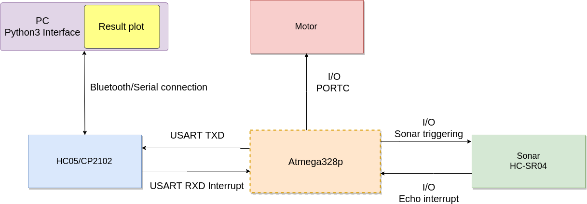
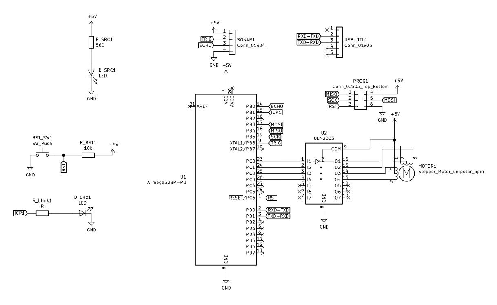
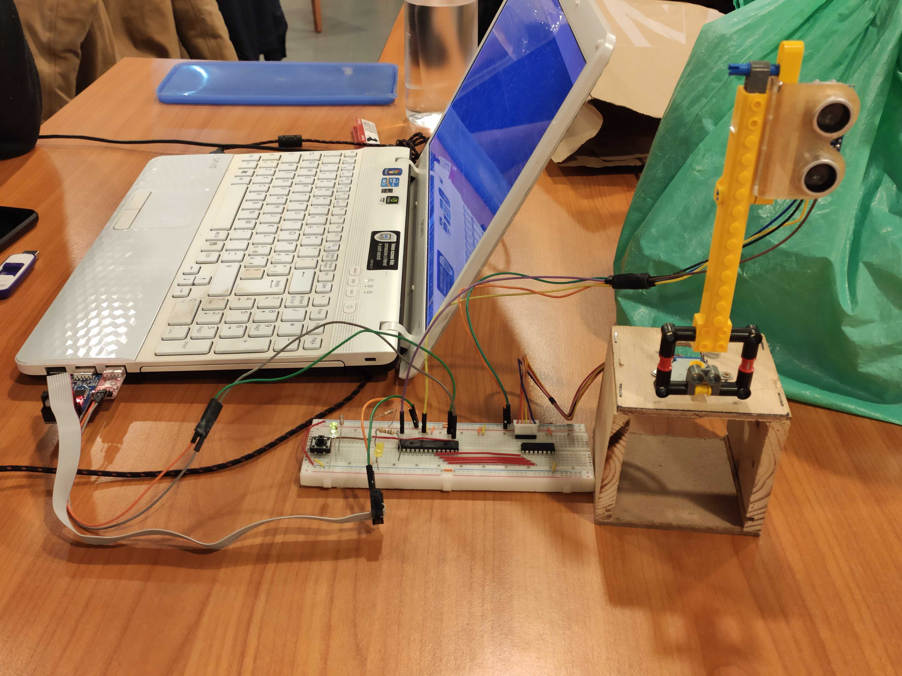
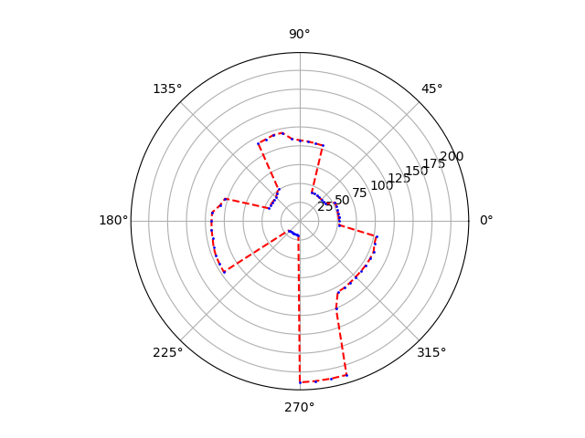

# Sonar mapping
This is a project made during my Erasmus+ at ISEP (Instituto Superior de Engenharia do Porto).

The request made for this project was to obtain a system capable of mapping a room, determining the distance of objects and walls from where the assessment is made. Furthermore, the system must be able to create a 2D map with the measures toke and to show them visually via the graphical interface.
For the development have been used a sonar that allows you to measure the distance, a stepper motor to be able to rotate the sensor, so it's possible to acquire the measurements at 360° and a USB to serial converter module (CP2102) to send the collected data to the PC via UART.
On the PC side was used Python and Qt to create a very simple interface able to:

1. Enable the UART connection
2. Send a signal to enable the measurements
3. Show a plot of the measurements took before

# Architecture


## Block description
### Atmega 328p:
The microcontroller deals with :

1. Driving the stepper motor: By configuring the PINC [0/1/2/3] the ULN2003 driver is configured which in turn drives the motor with the corresponding coil configuration.
2. Activate and deactivate Timer0 to time the rotation of the motor.
3. Communicate with the HC05 (Bluetooth)/CP2102 (USB to Serial converter) module to send and receive messages via USART through the RXE and TXE PINs. In particular, it receives a character ('A') to start the mapping. Subsequently, it takes care of communicating with the CP2102 module to send the data acquired during the measurement. Note that the data is not sent directly but is first converted by "double" a "string". the strings obtained are concatenated by creating the special string: "degreeValueString;distanceValueString\n".
This string will then be sent to the PC.
4. Activate the sonar: Operation that is performed by activating the PIN trigger (I / O) of the sonar for 15us (At least 10us is required).
5. Calculate the distance of an object: This operation is done by activating Timer1 when the Echo PIN (I / O) connected to the sonar detects a rising edge and saves the counter value when it detects a falling edge. Once the value is obtained, it is converted to [cm].

### Motor 28byj-48:
The motor rotates the sensor during data acquisition. Every 5,625° (Every 64 steps) set the flag to enable the measurement through sonar. During the measurement it maintains the current position and starts to rotate again after the data has been sent to the PC.

### Sonar HC-SR04:
Sonar is provided by the microcontroller via the PIN trigger, which must remain set for at least 15us. After sonar is enabled set the echo PIN and send the signal. When the signal goes back and hits the receiver it resets the echo PIN.

### HC05 (Bluetooth)/CP2102 (USB to serial converter):
HC05/CP2102 is used to receive the start measurement signal (the character 'A') from the PC (via interrupt). When this character is read room mapping begins.
Subsequently, serial connection is used to transmit the string, previously created by the microcontroller, with data relating to the position of the motor and the measured distance.

### PC side:
On the PC side through a program developed in Python it is possible to create the serial connection with the microcontroller. Once the connection is established, is possible to send the signal to start the measurement. Subsequently, the program takes care of reading the strings received from the serial port. The position and distance data are extracted from the string using regular expressions that eliminate special characters and save all the data in a list, which will then be used to create the map via the python library: "matplotlib.pyplot"

# Module Schematic

Below is possible to see all the components used for creating the system, also all the connection made between them.  
Note that in this schematic was use the CP2102 module.  
For using the Bluetooth the connection is the same but the HC-05 module require:
1. 1K resistence between his RXD PIN and the Atmega328's TXD PIN.
2. 2k resistence between his RXD PIN and the earth.




# PC side

On the PC side, a simple program has been developed in Python3. The program creates a serial connection with the board and asks if you want to start
mapping. If so, a start mapping command is sent to the microcontroller which allows it to activate the reading of the data.
During the room measurement, it is possible to see the data read by the microcontroller in the terminal.
At the end of the reading, the microcontroller sends an end communication command and a map with the data read is created.
A graphical version of this interface is [available here](https://github.com/ilgaiaz/sonarQt/tree/master).

## Connection setting

### USB to serial
If the connection is made with the Bluetooth CP2102 is necessary to change on `mapping.py` the serial connection.
By default is set to `/dev/ttyUSB0` so before star the program, is mandatory to check the corresponding connection an set it. If the connection is wrong
an error message is shown on the terminal.

### Bluetooth (Linux)
If the connection is made with the Bluetooth module is mandatory to create the serial connection before using it. 
For do that according to [ArchWiki](https://wiki.archlinux.org/index.php/Bluetooth#Console) 
is necessary to:
 
1. Pair the HC-05 (follow instruction on WikiArch)
2. Create the serial communication port

The second point can be made with these commands:

```
sudo modprobe rfcomm
sudo rfcomm bind rfcomm0 <device's MAC>
```

Check the connection with:

```
ls /dev |grep rfcomm
```

## Run
After the configuration, the code is ready and is possible to run the `mapping.py` file.

# Results

Below is possible to see the final project made and a result map.







